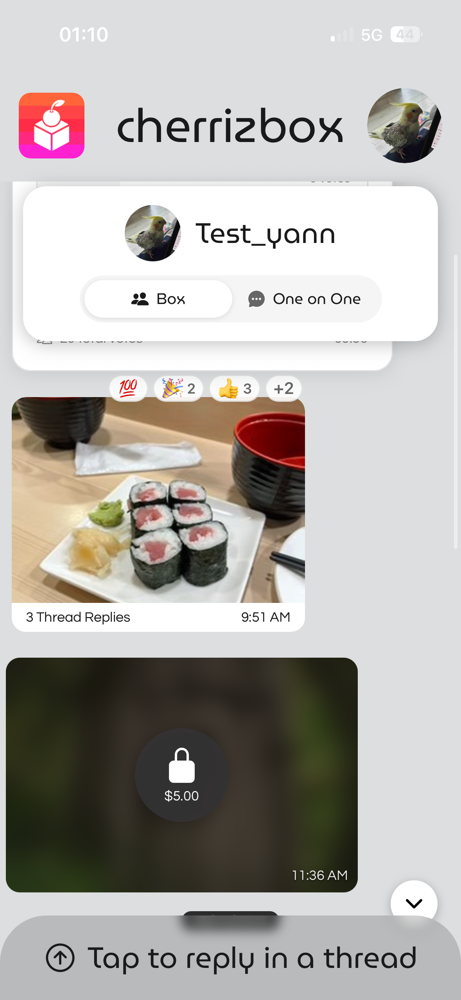
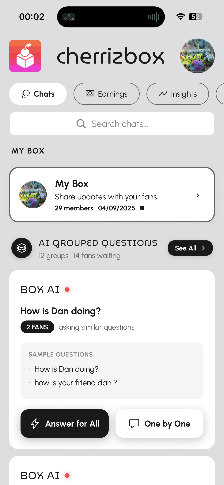
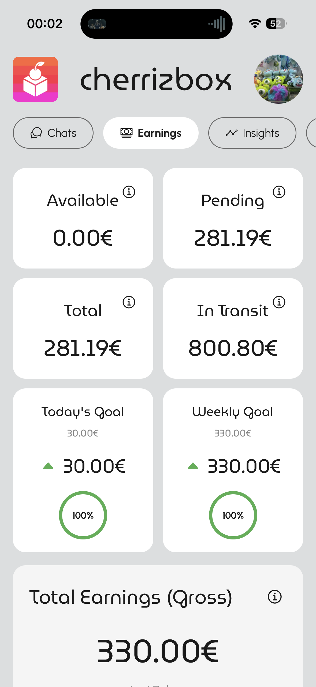
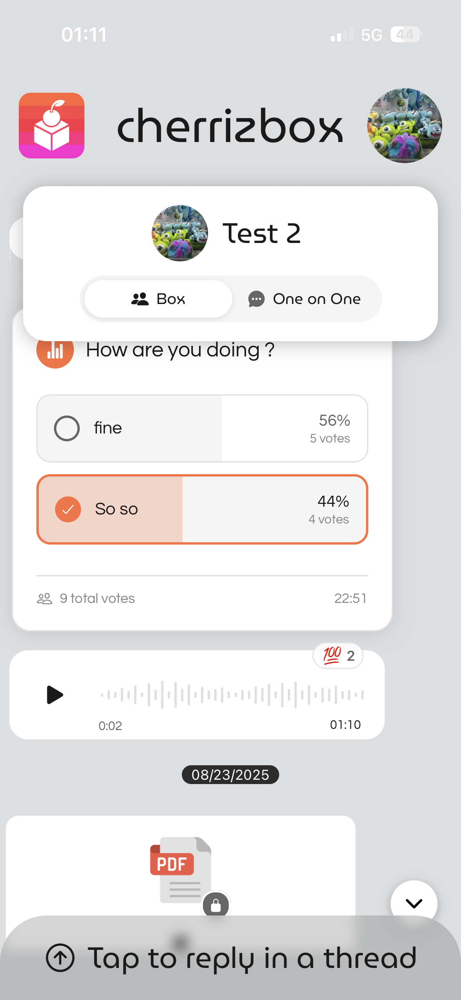

# Cherrizbox

> Channel your Mind. At Scale. Powered by AI. Driven by You.

Cherrizbox is a social platform that lets fans text their favorite creators—and helps creators reply at scale without losing their voice. Messages that can be answered the same way are automatically clustered so a creator can write one canonical answer and fan out personalized replies to thousands of fans.

- Website: [cherrizbox.com](https://www.cherrizbox.com/)
- Contact: hello@cherrizbox.com

---

## Table of Contents
- [Overview](#overview)
- [Key Features](#key-features)
- [How It Works (High-Level)](#how-it-works-high-level)
- [Architecture](#architecture)
- [Tech Stack](#tech-stack)
- [Product Screenshots](#product-screenshots)
- [Developer Docs](#developer-docs)
- [Getting Started](#getting-started)
- [Add Images to This README](#add-images-to-this-readme)
- [License](#license)

---

## Overview

Cherrizbox empowers creators with large audiences to handle thousands of 1‑to‑1 conversations in a single click—seamlessly, authentically, and always in their own tone. The platform clusters similar fan messages and lets the creator write one canonical answer that is then personalized and sent back to each fan.

---
| Main Page | Chat | Subscribtion |
| --- | --- | --- |
|  |  |  |
## Key Features

- AI Message Clustering: Similar questions are grouped so the creator answers once.
- Tone‑Matching Replies: Personalized responses adapt to the creator’s voice.
- Fan‑Out at Scale: One canonical answer → thousands of individualized replies.
- Pro Dashboard: Manage clusters, review drafts, and approve/send in batches.
- Analytics: Track clustering quality, reply confidence, and engagement.
- Monetization: Subscriptions, in‑chat purchases, drops, and donations (coming online progressively).

Learn more on our site: [cherrizbox.com](https://www.cherrizbox.com/)

---

## How It Works (High-Level)

1) Fans send messages  
2) AI parses multi‑question messages into focused questions  
3) Focused embeddings are generated for clustering  
4) Similar questions are clustered together  
5) Creator writes one canonical answer per cluster  
6) AI personalizes replies per fan and drafts them for review  
7) Creator approves and sends in batch

---

## Architecture

- Intent Recognition → Focused Embeddings → Clustering Engine → Pro Dashboard → Canonical Answer → Personalization → Fan Replies
- Core services and endpoints are documented in the AI system docs (see Developer Docs below).

---

## Tech Stack

- Frontend: React Native + Expo (CSS Tailwind library)
- Backend: Appwrite
- Vector DB: Upstash Vector
- Embeddings: OpenAI text-embedding-3-small
- LLMs: OpenAI GPT‑4o (canonical) and GPT‑4o‑mini (personalization)
- Orchestration: LangChain

---

## Product Screenshots

| Earnings Dashboard | Chat | Profile |
| --- | --- | --- |
|  |  |  |

---
